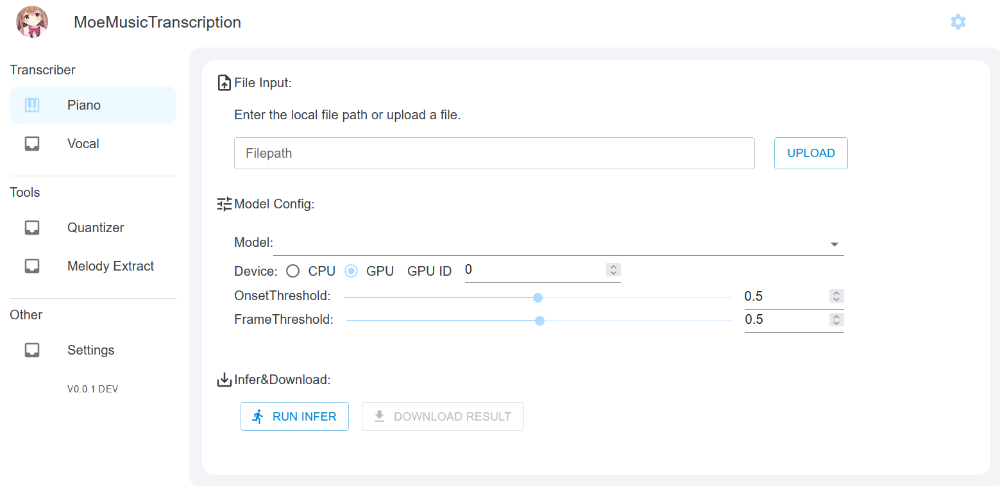

# Moe Music Transcription
[简体中文]   English(coming soon) 

## 关于

这是一个在本地运行的AI音乐转录软件，使用Python与React开发。目前仅支持钢琴转录。未来会尝试加入歌声转录，多乐器转录，以及后处理功能，例如：自动量化，节拍检测，自动钢琴左右手分离，乐谱草稿导出，乐谱OCR等。

### 模型

| 模型名称                        | 类型               | 数据集与训练                                                 | 用途                                                       |
| ------------------------------- | ------------------ | ------------------------------------------------------------ | ---------------------------------------------------------- |
| f0.919 n0.974-piano_only        | HPPNet（钢琴转录） | 在下方数据集基础上随机混合Slask非钢琴与吉他音频训练。        | 用于转录除钢琴外带有其他乐器的音频（重度混合的效果也一般） |
| mestro-maps_mus-my-f0.912n0.973 | HPPNet（钢琴转录） | 由Mestro，MAPS(MUS部分)，自己收集的数据集训练，验证使用Mestro Val部分。 | 用于转录纯钢琴音频                                         |
|                                 |                    |                                                              |                                                            |

## 使用方法

### 软件截图

### 钢琴转录

1. 下载Release中的压缩包，解压，双击`Launch.bat`运行
2. 上传你的音频文件或输入你的本地音频路径（目前仅支持wav,其他格式暂时请先转换或安装FFMPEG）
3. 选择模型
4. 考虑调整设置。GPU推荐4G以上显存使用。推荐Onset阈值：0.5，Frame阈值：0.4.可根据你自己的要求以及音频调整。
5. 点击`Run Infer`等待完成后，点击`Download Result`下载结果。

## 下一步工作

1. 加入歌声转录
2. 优化代码

## 开发相关

项目使用python，onnxruntime(dml)作为后端推理。WebUI使用React18，MUI5完成。

目前存在问题：使用onnxruntime推理结果与torch存在少量误差，略微影响了模型表现。

后续会补充开发流程，构建流程，以及本项目技术分享。

## 参考与引用

1. 转录算法：[HPPNet(GitHub)](https://github.com/WX-Wei/HPPNet)   [Arxiv](https://arxiv.org/abs/2208.14339v2)
2. 图标：《恋×シンアイ彼女》中的角色：姬野星奏

